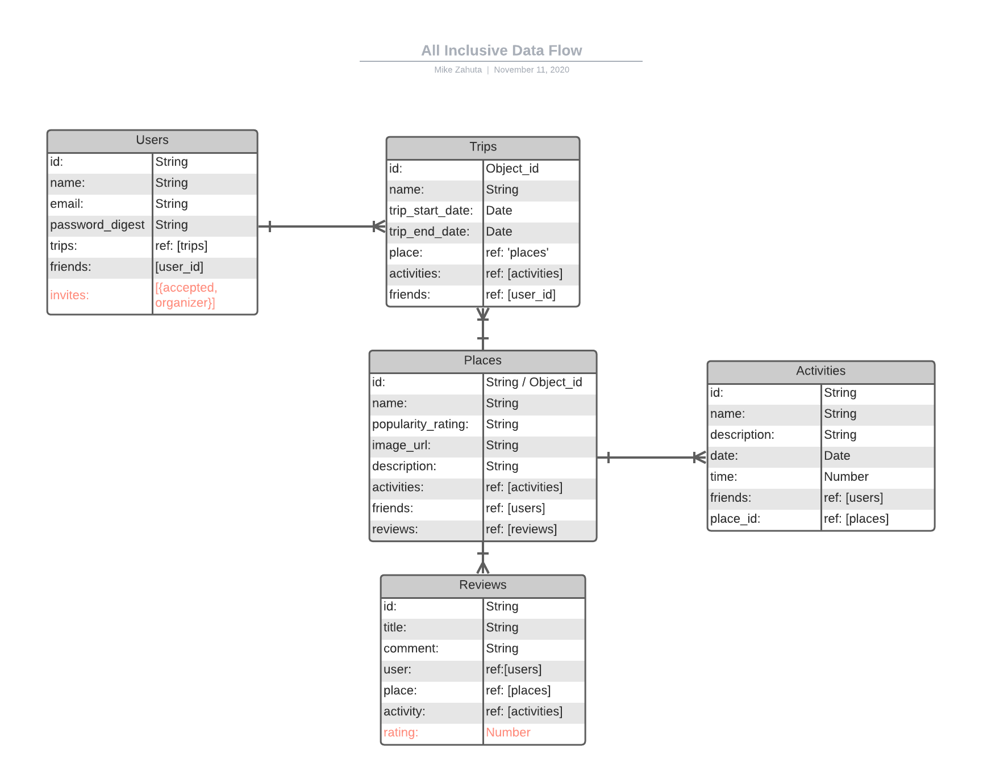

# All Inclusive
### Date: 11/10/20
### By: Michael Zahuta
***

Links: [Github](https://github.com/MikeyZboy) | [Linkedin](https://www.linkedin.com/in/mikezahuta/)

***
### Description ###

All Inclusive is a travel site for friends, family, and vagabonds who enjoy expectations.

Find places, activities, and who will be there so you can just relax and enjoy.

***
### Getting Started ###

Via web browser:

Simply navigate to All Inclusive website and sign up or log in:
 - Find information on various destinations around the world!
  
 - Discover activities where you're going!
  
 - Introduce yourself to people who will be sharing in the action!
  
 - Invite friends!

***
### User Stories ###

As a user, I should be able to land on the home page and see a short carousel of places to travel and an area to sign up/sign in.

As a user, I should also be able to access links to Discover, Connect, and Trips, with navigation to respective pages.

As a user, I should be able to "Discover" new places via a search bar or clickable cards. Upon clicking a card, I should be taken to options for the location that include activities to add to my trip plan and friends to share/invite to my trip.

As a user, I should be able to "Connect" with friends, family, or new faces who may be joining me while in those locations or on those activities. Connecting could mean inviting, befriending, and chatting with those folks directly.

As a user, I should be able to review my past and upcoming "Trips." Reviewing my trips should show me where I have been or am going next, activities I have planned or have already participated in, friends (or others) that will be joining or have joined me.

***
### Planned Updates ###

- [ ] TripPlanner Suggestions
- [ ] Friends - Introductions and Chat
- [ ] Mobile App

[Follow development here](https://trello.com/b/38FfjEM6/allinclusive)

  
Click to see the All Inclusive Trello Board!

***
### ERD/Mapping ###

***
### Technologies Used ###

- React
- Express
- Node
- Mongoose
- MongoDB
- HTML/CSS/Javascript
  
***
### License ####

All Inclusive is under the MIT license.

***
#### Credits ####

